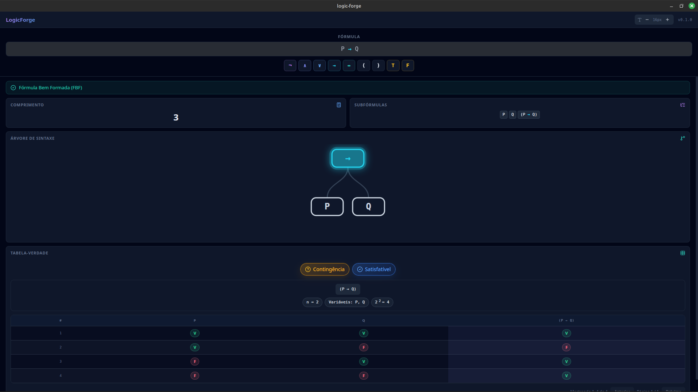
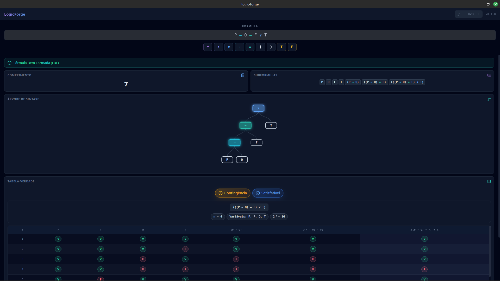

<!-- PROJECT_METADATA
{
  "title": "Logic Forge",
  "short_description": "App desktop Tauri + Rust que analisa fórmulas de lógica proposicional em tempo real: valida sintaxe, gera árvores sintáticas, tabelas-verdade e classifica tautologias.",
  "primary_stack": ["Rust", "React", "TypeScript", "Tauri", "Vite"],
  "architecture": "Desktop App",
  "detail_description": "Logic Forge é uma aplicação desktop construída com Tauri v2 onde o diferencial técnico está no parser de lógica proposicional implementado do zero em Rust. O parser usa análise sintática descendente recursiva (recursive descent parser) para construir uma Árvore Sintática Abstrata (AST) das fórmulas — suportando os conectivos ¬, ∧, ∨, →, ↔ com precedência correta e associatividade. A partir da AST, o avaliador gera a tabela-verdade completa para todas as 2^n combinações de variáveis e classifica a fórmula como: Tautologia (sempre verdadeira), Contradição (sempre falsa), Satisfazível (verdadeira para ao menos um caso) ou Contingência (nem tautologia nem contradição). O frontend React recebe os resultados via comandos Tauri tipados em TypeScript, com feedback visual imediato a cada caractere digitado — sem roundtrip de rede. O binário final tem apenas ~4MB e não requer instalação de runtime.",
  "images": ["IMG/print1.png", "IMG/print2.png"],
  "cover_image": "IMG/print1.png",
  "release_url": "https://github.com/Wanjos-eng/logic-forge/releases/tag/v0.1.0"
}
-->

# Logic Forge

App desktop para análise de lógica proposicional: parser Rust que valida fórmulas, gera árvores sintáticas (AST), tabelas-verdade e classifica tautologias — tudo em tempo real.

## Funcionalidades

- **Validação em tempo real** — feedback imediato a cada caractere digitado
- **Parser recursivo descendente** — implementado do zero em Rust, sem bibliotecas externas
- **Árvore Sintática Abstrata (AST)** — visualização da estrutura parseada
- **Tabela-verdade completa** — gerada para todas as 2^n combinações de variáveis
- **Classificação automática** — Tautologia / Contradição / Contingência / Satisfazível

## Stack Técnica

| Camada | Tecnologia |
|--------|-----------|
| Parser / Core Lógico | Rust (recursive descent parser, AST, evaluator) |
| Frontend | React + TypeScript |
| Bridge Desktop | Tauri v2 (comandos tipados TS↔Rust) |
| Build | Vite |

## Como Executar

```bash
npm install
cargo tauri dev       # Desenvolvimento
cargo tauri build     # Produção (~4MB, sem runtime)
```

## Download

[⬇ Baixar v0.1.0](https://github.com/Wanjos-eng/logic-forge/releases/tag/v0.1.0)

## Screenshots



